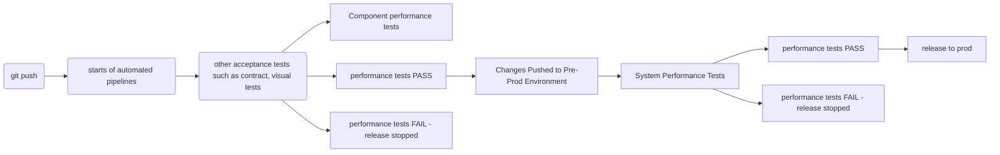

# testrepo

## Folder Structure
The source files are located into the /src folder 


### Test Execution / Running the tests

The tests are running using the command 
```
k6 run script.js
```

/src/createUsers.js

To create as many users as you want, you can run the scripts using the --iterations argument in the command line. 

Example:
```
k6 run createUsers.js --iterations=2
```

## cicd Integration

In this examole, Gitlab is used as a reference how this project can be used to run automated performance tests into a ci/cd pipeline. 

In theory, the script can also be used as an Acceptance Tests, run after each merge request to test the apis.

Hereafter, the Performance Stage run as part of the Acceptance Tests will be called Component Performance Test, and the Performance Tests run on the whole system will be called System Performance Test.

The aim/goal of the Performance Tests run during the Acceptance Tests Stage is ensure that the new changes in the code do not introduce performance degradation at a component level.

Whereas the aim/goal of th Performance Tests at a System Testing stage will ensure the applicaton as a whole can whitstand normal day to day activity and scalability for  buisness requirments. 
The Performance Tests during the Acceptance Tests stage does not 





