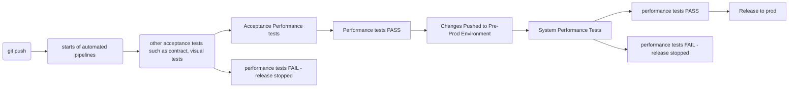

# CICD Integration

Gitlab will be used as a reference how this project can be used to run automated performance tests into a ci/cd pipeline.

Hereafter, the Performance Stage run as part of the Acceptance Tests will be called Component Performance Test, and the Performance Tests run on the whole system will be called System Performance Test.

The aim/goal of the Performance Tests run during the Acceptance Tests Stage is ensure that the new changes in the code do not introduce performance degradation at a component level.

Whereas the aim/goal of th Performance Tests at a System Testing stage will ensure the applicaton as a whole can whitstand normal day to day activity and scalability for  buisness requirments. 
The Performance Tests during the Acceptance Tests stage does not 

## Thresholds
Thresholds are a pass/fail criteria used to specify the performance expectations of the system under test.

Example expectations (Thresholds):
```
System doesn't produce more than 1% errors.
Response time for 95% of requests should be below 200ms.
Response time for 99% of requests should be below 400ms.
Specific endpoint must always respond within 300ms.
```

Thresholds analyze the performance metrics and determine the final test result (pass/fail).

Here is a sample script that specifies two thresholds, one evaluating the rate of http errors (http_req_failed metric) and one using the 95 percentile of all the response durations (the http_req_duration metric).

```
thresholds: {
        http_req_failed: ['rate<0.10'], // http errors should be less than 10%
        http_req_duration: ['p(95)<500'], // 95% of requests should be below 500ms
    },
```
Thresholds make perfect sense when integrating the performance test into a ci/cd pipeline.  This type of checks will allow the ci/cd pipeline to fail the release if the app under test does not meet these quality gates.

## Types of Performance Testing into a Ci/Cd Pipline

There are 2 type of Performance tests that can be integrated into a ci/cd pipeline.  Acceptance Performance Testing and System Performance Testing.

### Acceptance Performance Testing
Acceptance Performance Testing is executed with a push request.  It can be run on a branch.  The Acceptance Performance Testing tests the application under test for a specific response time with a controlled load.
Acceptance Performance testing usually targets a particular component only of an app.  In this exercise, the script _addbooksUserJourneyTestCSV.js_ can be used to execute Acceptance Performance Testing.

### System Performance Testing
System Performance Testing is executed prior to release.  Usually run on a pre-prod environment, it tests the whole system concurrently.  In this example, other scripts will be required to perform a system test.  
System Performance Testing usually replicate production traffic. This is played back at scalable load, such as 120% of production load, to verify scalability of the system. 

Usually thresholds in this stage vaies a lot from the Acceptance Performance Testing stage.  The aim of the 2 stages is completely different. 




